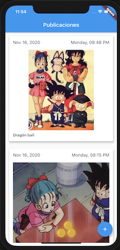
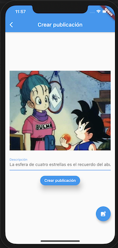

# Dragon Ball Posts
A Flutter APP to create and show post list in real time

Applying the concepts:

* Firebase Cloud Firestore
* Firebase Storage
* BLoC Pattern with ```flutter_bloc``` and ```equatable```
* ImagePicker with ```image_picker```
* StreamSubscription

# Functionality
An APP Android/iOS which consists of creating posts (images with description) and show posts list in real time from multiple devices.
Use Firestore to save the post information, and use Firebase Storage to save the images files.


## Screenshots


|  Posts      |  Create Post      |
|------------|-------------|
|  |    |
